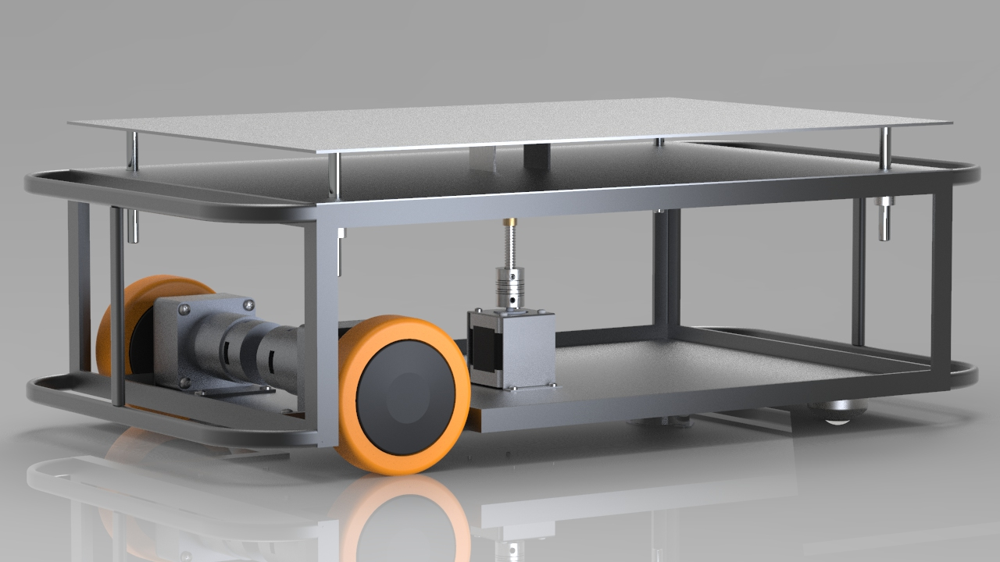

  

<h1 align="center">AGV</h1>

---
## MECHANICAL progress
SW tools used: [SolidWorks ](https://www.solidworks.com/)

***Responsibilities***
   * 3D design.
   * Analysis.
   * Mechanisms. 
   * Manufacturing.
   * etc.

***Progress***: can be found in file [mechanicalTasks.xlsx](https://github.com/CLR-2021/agv-mechanical/blob/master/mechanicalTasks.xlsx)

*Featured image:*

  

---
## All Project
For detailed information about: 
* Vision
* Team Hierarchy
* Future Work
* Working of other technical teams  
* Licenses of the project
* Sponsorship

Check this readme page for detailed information about the project: [agv-documents](https://github.com/CLR-2021/agv-documents)